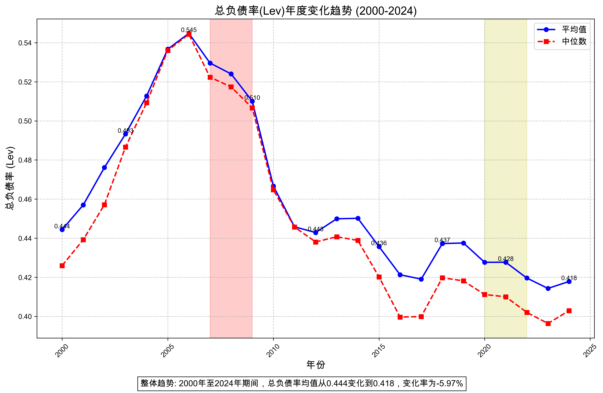
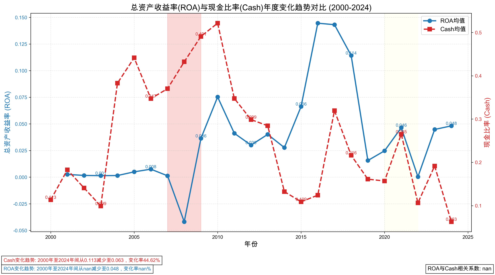
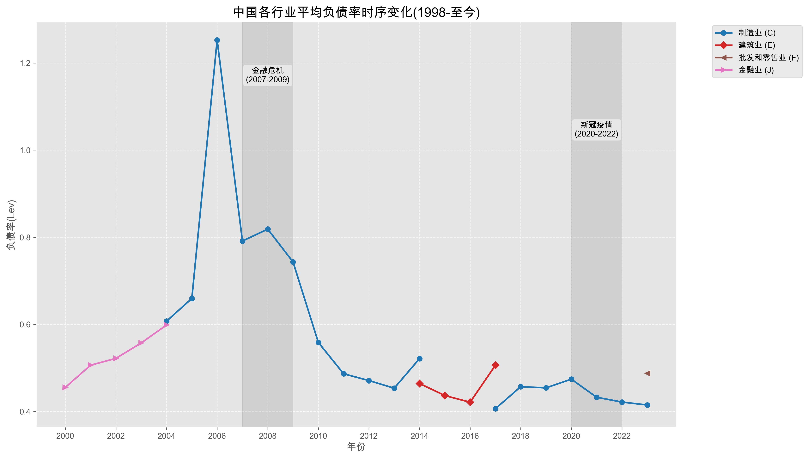

# 金融时间序列数据分析

# A. 金融指标年度统计分析 (2000-今)

## Lev - 总负债率 = 总负债/总资产

| 年份 | 平均值 | 中位数 | 标准差 | 最小值 | 最大值 |
|------|--------|--------|--------|--------|--------|
| 2000 | 0.4444 | 0.4260 | 0.1971 | 0.0535 | 1.1220 |
| 2001 | 0.4570 | 0.4392 | 0.2043 | 0.0535 | 1.1220 |
| 2002 | 0.4761 | 0.4571 | 0.2026 | 0.0535 | 1.1220 |
| 2003 | 0.4933 | 0.4866 | 0.2101 | 0.0535 | 1.1220 |
| 2004 | 0.5128 | 0.5093 | 0.2127 | 0.0535 | 1.1220 |
| 2005 | 0.5367 | 0.5360 | 0.2211 | 0.0535 | 1.1220 |
| 2006 | 0.5448 | 0.5443 | 0.2220 | 0.0535 | 1.1220 |
| 2007 | 0.5296 | 0.5223 | 0.2179 | 0.0535 | 1.1220 |
| 2008 | 0.5240 | 0.5174 | 0.2254 | 0.0535 | 1.1220 |
| 2009 | 0.5101 | 0.5066 | 0.2342 | 0.0535 | 1.1220 |
| 2010 | 0.4667 | 0.4647 | 0.2471 | 0.0535 | 1.1220 |
| 2011 | 0.4458 | 0.4457 | 0.2479 | 0.0535 | 1.1220 |
| 2012 | 0.4429 | 0.4381 | 0.2396 | 0.0535 | 1.1220 |
| 2013 | 0.4499 | 0.4407 | 0.2277 | 0.0535 | 1.1220 |
| 2014 | 0.4502 | 0.4389 | 0.2232 | 0.0535 | 1.1220 |
| 2015 | 0.4357 | 0.4202 | 0.2177 | 0.0535 | 1.1220 |
| 2016 | 0.4213 | 0.3996 | 0.2153 | 0.0535 | 1.1220 |
| 2017 | 0.4191 | 0.3999 | 0.2130 | 0.0535 | 1.1220 |
| 2018 | 0.4372 | 0.4198 | 0.2152 | 0.0535 | 1.1220 |
| 2019 | 0.4375 | 0.4182 | 0.2208 | 0.0535 | 1.1220 |
| 2020 | 0.4277 | 0.4112 | 0.2217 | 0.0535 | 1.1220 |
| 2021 | 0.4277 | 0.4100 | 0.2208 | 0.0535 | 1.1220 |
| 2022 | 0.4196 | 0.4020 | 0.2219 | 0.0535 | 1.1220 |
| 2023 | 0.4143 | 0.3964 | 0.2199 | 0.0535 | 1.1220 |
| 2024 | 0.4179 | 0.4029 | 0.2165 | 0.0535 | 1.1220 |

### 统计分析

- **总体趋势**: 从2000年到2024年，Lev指标总体下降趋势，变化幅度约为5.97%。
- **峰值年份**: 2006年，平均值为0.5448
- **谷值年份**: 2023年，平均值为0.4143
- **平均波动性**: 标准差均值为0.2206
- **波动最大年份**: 2011年，标准差为0.2479
- **金融危机影响**: 2007-2009年金融危机期间，Lev指标相比危机前(2004-2006)期间下降1.92%。
- **COVID-19影响**: 2020-2022年疫情期间，Lev指标相比疫情前(2017-2019)期间下降1.46%。

---

## SL - 流动负债率 = 流动负债/总资产

| 年份 | 平均值 | 中位数 | 标准差 | 最小值 | 最大值 |
|------|--------|--------|--------|--------|--------|
| 2000 | 0.3579 | 0.3620 | 0.5411 | 0.0000 | 1.0000 |
| 2001 | 0.3751 | 0.3924 | 0.5718 | 0.0000 | 1.0000 |
| 2002 | 0.3748 | 0.4083 | 0.5677 | 0.0000 | 1.0000 |
| 2003 | 0.3803 | 0.4532 | 0.5458 | 0.0000 | 1.0000 |
| 2004 | 0.4008 | 0.4559 | 0.5813 | 0.0000 | 1.0000 |
| 2005 | 0.4503 | 0.4754 | 0.6242 | 0.0000 | 1.0000 |
| 2006 | 0.4646 | 0.5029 | 0.6301 | 0.0000 | 1.0000 |
| 2007 | 0.5265 | 0.5252 | 0.7013 | 0.0000 | 1.0000 |
| 2008 | 0.5025 | 0.5560 | 0.6200 | 0.0000 | 1.0000 |
| 2009 | 0.5713 | 0.5533 | 0.7296 | 0.0000 | 1.0000 |
| 2010 | 0.6016 | 0.5796 | 0.7432 | 0.0000 | 1.0000 |
| 2011 | 0.5914 | 0.6363 | 0.6921 | 0.0000 | 1.0000 |
| 2012 | 0.6028 | 0.6768 | 0.6974 | 0.0000 | 1.0000 |
| 2013 | 0.6302 | 0.7275 | 0.6950 | 0.0000 | 1.0000 |
| 2014 | 0.6642 | 0.7624 | 0.7258 | 0.0000 | 1.0000 |
| 2015 | 0.6954 | 0.8029 | 0.7407 | 0.0000 | 1.0000 |
| 2016 | 0.7405 | 0.8302 | 0.7830 | 0.0000 | 1.0000 |
| 2017 | 0.7600 | 0.8548 | 0.7893 | 0.0000 | 1.0000 |
| 2018 | 0.7704 | 0.8683 | 0.8059 | 0.0000 | 1.0000 |
| 2019 | 0.7943 | 0.8541 | 0.8239 | 0.0000 | 1.0000 |
| 2020 | 0.8137 | 0.8204 | 0.8625 | 0.0000 | 1.0000 |
| 2021 | 0.7794 | 0.8023 | 0.8309 | 0.0000 | 1.0000 |
| 2022 | 0.7966 | 0.8257 | 0.8488 | 0.0000 | 1.0000 |
| 2023 | 0.7869 | 0.8196 | 0.8314 | 0.0000 | 1.0000 |
| 2024 | 1.0000 | 1.0000 | 1.0000 | 0.0000 | 1.0000 |

### 统计分析

- **总体趋势**: 从2000年到2024年，SL指标总体上升趋势，变化幅度约为179.41%。
- **峰值年份**: 2024年，平均值为1.0000
- **谷值年份**: 2000年，平均值为0.3579
- **平均波动性**: 标准差均值为0.7193
- **波动最大年份**: 2024年，标准差为1.0000
- **金融危机影响**: 2007-2009年金融危机期间，SL指标相比危机前(2004-2006)期间上升21.63%。
- **COVID-19影响**: 2020-2022年疫情期间，SL指标相比疫情前(2017-2019)期间上升2.79%。

---

## LL - 长期负债率 = 长期负债/总资产

| 年份 | 平均值 | 中位数 | 标准差 | 最小值 | 最大值 |
|------|--------|--------|--------|--------|--------|
| 2000 | 0.0420 | 0.1319 | 0.0466 | 0.0000 | 0.1741 |
| 2001 | 0.0630 | 0.1416 | 0.1605 | 0.0000 | 1.0000 |
| 2002 | 0.0717 | 0.1551 | 0.1777 | 0.0000 | 1.0000 |
| 2003 | 0.0818 | 0.1860 | 0.1745 | 0.0000 | 1.0000 |
| 2004 | 0.0961 | 0.1801 | 0.1729 | 0.0000 | 1.0000 |
| 2005 | 0.1033 | 0.1722 | 0.1810 | 0.0000 | 1.0000 |
| 2006 | 0.1464 | 0.1724 | 0.2535 | 0.0000 | 1.0000 |
| 2007 | 0.1956 | 0.1606 | 0.3131 | 0.0000 | 1.0000 |
| 2008 | 0.2393 | 0.1656 | 0.3571 | 0.0000 | 1.0000 |
| 2009 | 0.2956 | 0.2108 | 0.4222 | 0.0000 | 1.0000 |
| 2010 | 0.3000 | 0.1623 | 0.4275 | 0.0000 | 1.0000 |
| 2011 | 0.3167 | 0.1243 | 0.4530 | 0.0000 | 1.0000 |
| 2012 | 0.3656 | 0.1485 | 0.5124 | 0.0000 | 1.0000 |
| 2013 | 0.4054 | 0.2206 | 0.5419 | 0.0000 | 1.0000 |
| 2014 | 0.4464 | 0.2586 | 0.5974 | 0.0000 | 1.0000 |
| 2015 | 0.4963 | 0.2079 | 0.6547 | 0.0000 | 1.0000 |
| 2016 | 0.5363 | 0.2392 | 0.6889 | 0.0000 | 1.0000 |
| 2017 | 0.5199 | 0.2369 | 0.6770 | 0.0000 | 1.0000 |
| 2018 | 0.5681 | 0.2588 | 0.7196 | 0.0000 | 1.0000 |
| 2019 | 0.5777 | 0.2922 | 0.7277 | 0.0000 | 1.0000 |
| 2020 | 0.5725 | 0.2320 | 0.7241 | 0.0000 | 1.0000 |
| 2021 | 0.6151 | 0.5064 | 0.7519 | 0.0000 | 1.0000 |
| 2022 | 0.6364 | 0.6133 | 0.7625 | 0.0000 | 1.0000 |
| 2023 | 0.6598 | 0.7312 | 0.7703 | 0.0000 | 1.0000 |
| 2024 | 1.0000 | 1.0000 | 1.0000 | 0.0000 | 1.0000 |

### 统计分析

- **总体趋势**: 从2000年到2024年，LL指标总体上升趋势，变化幅度约为2281.66%。
- **峰值年份**: 2024年，平均值为1.0000
- **谷值年份**: 2000年，平均值为0.0420
- **平均波动性**: 标准差均值为0.4907
- **波动最大年份**: 2024年，标准差为1.0000
- **金融危机影响**: 2007-2009年金融危机期间，LL指标相比危机前(2004-2006)期间上升111.21%。
- **COVID-19影响**: 2020-2022年疫情期间，LL指标相比疫情前(2017-2019)期间上升9.50%。

---

## SDR - 短债比率 = 流动负债/总负债

| 年份 | 平均值 | 中位数 | 标准差 | 最小值 | 最大值 |
|------|--------|--------|--------|--------|--------|
| 2000 | 0.8577 | 0.9263 | 0.1796 | 0.0000 | 1.0000 |
| 2001 | 0.8619 | 0.9274 | 0.1760 | 0.0000 | 1.0000 |
| 2002 | 0.8526 | 0.9180 | 0.1837 | 0.0000 | 1.0000 |
| 2003 | 0.8482 | 0.9225 | 0.1891 | 0.0000 | 1.0000 |
| 2004 | 0.8525 | 0.9305 | 0.1880 | 0.0000 | 1.0000 |
| 2005 | 0.8532 | 0.9290 | 0.1879 | 0.0000 | 1.0000 |
| 2006 | 0.8384 | 0.9152 | 0.1958 | 0.0000 | 1.0000 |
| 2007 | 0.8336 | 0.9168 | 0.2061 | 0.0000 | 1.0000 |
| 2008 | 0.8046 | 0.8884 | 0.2212 | 0.0000 | 1.0000 |
| 2009 | 0.8107 | 0.8923 | 0.2179 | 0.0000 | 1.0000 |
| 2010 | 0.8256 | 0.9053 | 0.2101 | 0.0000 | 1.0000 |
| 2011 | 0.8130 | 0.8914 | 0.2143 | 0.0000 | 1.0000 |
| 2012 | 0.8070 | 0.8801 | 0.2108 | 0.0000 | 1.0000 |
| 2013 | 0.7996 | 0.8692 | 0.2104 | 0.0000 | 1.0000 |
| 2014 | 0.8007 | 0.8694 | 0.2071 | 0.0000 | 1.0000 |
| 2015 | 0.8028 | 0.8699 | 0.2064 | 0.0000 | 1.0000 |
| 2016 | 0.8077 | 0.8738 | 0.2055 | 0.0000 | 1.0000 |
| 2017 | 0.8161 | 0.8827 | 0.2025 | 0.0000 | 1.0000 |
| 2018 | 0.8043 | 0.8690 | 0.2074 | 0.0000 | 1.0000 |
| 2019 | 0.7992 | 0.8667 | 0.2089 | 0.0000 | 1.0000 |
| 2020 | 0.7872 | 0.8526 | 0.2077 | 0.0000 | 1.0000 |
| 2021 | 0.7833 | 0.8471 | 0.2067 | 0.0000 | 1.0000 |
| 2022 | 0.7713 | 0.8344 | 0.2102 | 0.0000 | 1.0000 |
| 2023 | 0.8226 | 0.8976 | 0.2075 | 0.0000 | 1.0000 |
| 2024 | 0.8539 | 0.9294 | 0.1983 | 0.0000 | 1.0000 |

### 统计分析

- **总体趋势**: 从2000年到2024年，SDR指标总体下降趋势，变化幅度约为0.45%。
- **峰值年份**: 2001年，平均值为0.8619
- **谷值年份**: 2022年，平均值为0.7713
- **平均波动性**: 标准差均值为0.2023
- **波动最大年份**: 2008年，标准差为0.2212
- **金融危机影响**: 2007-2009年金融危机期间，SDR指标相比危机前(2004-2006)期间下降3.74%。
- **COVID-19影响**: 2020-2022年疫情期间，SDR指标相比疫情前(2017-2019)期间下降3.22%。

---

## Cash - 现金比率 = 公司年末持有的现金和现金等价物/总资产

| 年份 | 平均值 | 中位数 | 标准差 | 最小值 | 最大值 |
|------|--------|--------|--------|--------|--------|
| 2000 | 0.1134 | 0.1134 | 0.0000 | 0.1134 | 0.1134 |
| 2001 | 0.1827 | 0.1827 | 0.0000 | 0.1827 | 0.1827 |
| 2002 | 0.1408 | 0.1408 | 0.0000 | 0.1408 | 0.1408 |
| 2003 | 0.0991 | 0.0991 | 0.0000 | 0.0991 | 0.0991 |
| 2004 | 0.3829 | 0.5227 | 0.1999 | 0.0628 | 0.5227 |
| 2005 | 0.4415 | 0.3989 | 0.0588 | 0.3989 | 0.5227 |
| 2006 | 0.3472 | 0.3226 | 0.0357 | 0.3226 | 0.3989 |
| 2007 | 0.3701 | 0.3905 | 0.0311 | 0.3226 | 0.3905 |
| 2008 | 0.4323 | 0.4494 | 0.0268 | 0.3905 | 0.4494 |
| 2009 | 0.4909 | 0.5059 | 0.0249 | 0.4494 | 0.5059 |
| 2010 | 0.5215 | 0.5259 | 0.0084 | 0.5059 | 0.5259 |
| 2011 | 0.3477 | 0.3023 | 0.0899 | 0.1954 | 0.5259 |
| 2012 | 0.2988 | 0.2981 | 0.0034 | 0.2169 | 0.3299 |
| 2013 | 0.2846 | 0.2813 | 0.0066 | 0.2813 | 0.2981 |
| 2014 | 0.1324 | 0.0992 | 0.0703 | 0.0628 | 0.2813 |
| 2015 | 0.1089 | 0.1108 | 0.0043 | 0.0992 | 0.1108 |
| 2016 | 0.1242 | 0.1265 | 0.0056 | 0.1108 | 0.1265 |
| 2017 | 0.3195 | 0.3493 | 0.0761 | 0.1265 | 0.4271 |
| 2018 | 0.2163 | 0.1953 | 0.0527 | 0.1153 | 0.3563 |
| 2019 | 0.1612 | 0.1561 | 0.0132 | 0.1561 | 0.1953 |
| 2020 | 0.1569 | 0.1600 | 0.0518 | 0.0628 | 0.2847 |
| 2021 | 0.2650 | 0.2847 | 0.0580 | 0.0950 | 0.5259 |
| 2022 | 0.1065 | 0.0950 | 0.0324 | 0.0628 | 0.1996 |
| 2023 | 0.1917 | 0.1996 | 0.0425 | 0.0628 | 0.5259 |
| 2024 | 0.0628 | 0.0628 | 0.0000 | 0.0628 | 0.0628 |

### 统计分析

- **总体趋势**: 从2000年到2024年，Cash指标总体下降趋势，变化幅度约为44.62%。
- **峰值年份**: 2010年，平均值为0.5215
- **谷值年份**: 2024年，平均值为0.0628
- **平均波动性**: 标准差均值为0.0357
- **波动最大年份**: 2004年，标准差为0.1999
- **金融危机影响**: 2007-2009年金融危机期间，Cash指标相比危机前(2004-2006)期间上升10.38%。
- **COVID-19影响**: 2020-2022年疫情期间，Cash指标相比疫情前(2017-2019)期间下降24.18%。

---

## ROA - 净利润/总资产

| 年份 | 平均值 | 中位数 | 标准差 | 最小值 | 最大值 |
|------|--------|--------|--------|--------|--------|
| 2000 | nan | nan | nan | nan | nan |
| 2001 | 0.0026 | 0.0026 | 0.0000 | 0.0026 | 0.0026 |
| 2002 | 0.0016 | 0.0016 | 0.0000 | 0.0016 | 0.0016 |
| 2003 | 0.0014 | 0.0014 | 0.0000 | 0.0014 | 0.0014 |
| 2004 | 0.0015 | 0.0015 | 0.0000 | 0.0015 | 0.0016 |
| 2005 | 0.0050 | 0.0050 | 0.0000 | 0.0050 | 0.0050 |
| 2006 | 0.0075 | 0.0075 | 0.0001 | 0.0016 | 0.0075 |
| 2007 | 0.0013 | 0.0013 | 0.0000 | 0.0013 | 0.0013 |
| 2008 | -0.0418 | -0.0625 | 0.0321 | -0.0625 | 0.0086 |
| 2009 | 0.0364 | 0.0764 | 0.0610 | -0.0625 | 0.0764 |
| 2010 | 0.0753 | 0.0758 | 0.0052 | 0.0014 | 0.0764 |
| 2011 | 0.0412 | 0.0280 | 0.0214 | 0.0280 | 0.0758 |
| 2012 | 0.0301 | 0.0308 | 0.0012 | 0.0280 | 0.0308 |
| 2013 | 0.0402 | 0.0434 | 0.0055 | 0.0308 | 0.0434 |
| 2014 | 0.0278 | 0.0227 | 0.0090 | 0.0131 | 0.0764 |
| 2015 | 0.0664 | 0.0263 | 0.0493 | 0.0227 | 0.1441 |
| 2016 | 0.1446 | 0.1441 | 0.0023 | 0.0308 | 0.1479 |
| 2017 | 0.1432 | 0.1479 | 0.0161 | -0.0625 | 0.1479 |
| 2018 | 0.1142 | 0.1232 | 0.0284 | 0.0014 | 0.1232 |
| 2019 | 0.0156 | 0.0151 | 0.0030 | -0.0625 | 0.0764 |
| 2020 | 0.0247 | 0.0202 | 0.0117 | -0.0078 | 0.1199 |
| 2021 | 0.0465 | 0.0541 | 0.0206 | -0.0625 | 0.1115 |
| 2022 | 0.0004 | -0.0078 | 0.0234 | -0.0625 | 0.1479 |
| 2023 | 0.0448 | 0.0355 | 0.0409 | -0.0625 | 0.1479 |
| 2024 | 0.0482 | 0.0280 | 0.0535 | -0.0625 | 0.1479 |

### 统计分析

- **总体趋势**: 从2000年到2024年，ROA指标总体变化趋势不明确（初始值为0或缺失）。
- **峰值年份**: 2016年，平均值为0.1446
- **谷值年份**: 2008年，平均值为-0.0418
- **平均波动性**: 标准差均值为0.0160
- **波动最大年份**: 2009年，标准差为0.0610
- **金融危机影响**: 2007-2009年金融危机期间，ROA指标相比危机前(2004-2006)期间下降129.53%。
- **COVID-19影响**: 2020-2022年疫情期间，ROA指标相比疫情前(2017-2019)期间下降73.79%。

---

## ROE - 净利润/净资产

| 年份 | 平均值 | 中位数 | 标准差 | 最小值 | 最大值 |
|------|--------|--------|--------|--------|--------|
| 2000 | nan | nan | nan | nan | nan |
| 2001 | 0.1147 | 0.1147 | 0.0000 | 0.1147 | 0.1147 |
| 2002 | 0.0798 | 0.0798 | 0.0000 | 0.0798 | 0.0798 |
| 2003 | 0.0619 | 0.0619 | 0.0000 | 0.0619 | 0.0619 |
| 2004 | 0.0698 | 0.0697 | 0.0003 | 0.0697 | 0.0798 |
| 2005 | 0.2012 | 0.2012 | 0.0000 | 0.2012 | 0.2012 |
| 2006 | 0.2037 | 0.2037 | 0.0032 | 0.0798 | 0.2037 |
| 2007 | 0.0374 | 0.0374 | 0.0000 | 0.0374 | 0.0374 |
| 2008 | -0.0187 | -0.1048 | 0.1408 | -0.1048 | 0.2254 |
| 2009 | 0.1278 | 0.2254 | 0.1460 | -0.1048 | 0.2254 |
| 2010 | 0.1332 | 0.0971 | 0.0588 | 0.0228 | 0.2254 |
| 2011 | 0.0586 | 0.0439 | 0.0238 | 0.0439 | 0.0971 |
| 2012 | 0.0488 | 0.0505 | 0.0029 | 0.0439 | 0.0505 |
| 2013 | 0.0656 | 0.0708 | 0.0089 | 0.0505 | 0.0708 |
| 2014 | 0.0428 | 0.0337 | 0.0163 | 0.0337 | 0.2254 |
| 2015 | 0.0752 | 0.0337 | 0.0496 | 0.0336 | 0.1701 |
| 2016 | 0.1593 | 0.1552 | 0.0108 | 0.0505 | 0.2064 |
| 2017 | 0.1752 | 0.1823 | 0.0209 | -0.1048 | 0.2012 |
| 2018 | 0.1323 | 0.1402 | 0.0270 | 0.0337 | 0.2254 |
| 2019 | 0.0374 | 0.0357 | 0.0079 | -0.1048 | 0.2254 |
| 2020 | 0.0590 | 0.0524 | 0.0175 | -0.0084 | 0.2254 |
| 2021 | 0.0871 | 0.1015 | 0.0370 | -0.1048 | 0.2254 |
| 2022 | 0.0064 | -0.0084 | 0.0420 | -0.1048 | 0.2254 |
| 2023 | 0.1155 | 0.1451 | 0.0616 | -0.1048 | 0.2254 |
| 2024 | 0.0946 | 0.0971 | 0.0779 | -0.1048 | 0.2254 |

### 统计分析

- **总体趋势**: 从2000年到2024年，ROE指标总体变化趋势不明确（初始值为0或缺失）。
- **峰值年份**: 2006年，平均值为0.2037
- **谷值年份**: 2008年，平均值为-0.0187
- **平均波动性**: 标准差均值为0.0314
- **波动最大年份**: 2009年，标准差为0.1460
- **金融危机影响**: 2007-2009年金融危机期间，ROE指标相比危机前(2004-2006)期间下降69.13%。
- **COVID-19影响**: 2020-2022年疫情期间，ROE指标相比疫情前(2017-2019)期间下降55.82%。

---

## SLoan - 短期银行借款/总资产

| 年份 | 平均值 | 中位数 | 标准差 | 最小值 | 最大值 |
|------|--------|--------|--------|--------|--------|
| 2000 | 0.0000 | 0.0000 | 0.0000 | 0.0000 | 0.0000 |
| 2001 | 0.7135 | 0.5282 | 0.7403 | 0.0000 | 6.5854 |
| 2002 | 0.7191 | 0.5173 | 0.7767 | 0.0018 | 6.5854 |
| 2003 | 0.7225 | 0.5002 | 0.8001 | 0.0015 | 6.5854 |
| 2004 | 0.9950 | 0.6848 | 1.0594 | 0.0019 | 6.5854 |
| 2005 | 0.6839 | 0.4182 | 0.9305 | 0.0008 | 6.5854 |
| 2006 | 0.3882 | 0.2126 | 0.6634 | 0.0000 | 6.5854 |
| 2007 | 0.0750 | 0.0000 | 0.4420 | 0.0000 | 6.5854 |
| 2008 | 0.0922 | 0.0367 | 0.3910 | 0.0000 | 6.5854 |
| 2009 | 0.1264 | 0.0500 | 0.4472 | 0.0000 | 6.5854 |
| 2010 | 0.0954 | 0.0385 | 0.3660 | 0.0000 | 6.5854 |
| 2011 | 0.1248 | 0.0596 | 0.3971 | 0.0000 | 6.5854 |
| 2012 | 0.1667 | 0.0851 | 0.4433 | 0.0000 | 6.5854 |
| 2013 | 0.1768 | 0.0932 | 0.3736 | 0.0000 | 6.5854 |
| 2014 | 0.3359 | 0.1533 | 0.7239 | 0.0000 | 6.5854 |
| 2015 | 0.1438 | 0.0483 | 0.4046 | 0.0000 | 6.5854 |
| 2016 | 2.4452 | 1.5714 | 2.3314 | 0.0000 | 6.5854 |
| 2017 | 0.1188 | 0.0000 | 0.6472 | 0.0000 | 6.5854 |
| 2018 | 0.0000 | 0.0000 | 0.0000 | 0.0000 | 0.0000 |
| 2019 | 0.0936 | 0.0378 | 0.2083 | 0.0000 | 4.8222 |
| 2020 | 0.4518 | 0.2081 | 0.7929 | 0.0000 | 6.5854 |
| 2021 | 0.1374 | 0.0393 | 0.3470 | 0.0000 | 6.5854 |
| 2022 | 0.0475 | 0.0092 | 0.1083 | 0.0000 | 1.4745 |
| 2023 | 0.0587 | 0.0224 | 0.0980 | 0.0000 | 1.8458 |
| 2024 | 0.0056 | 0.0029 | 0.0150 | 0.0000 | 0.4620 |

### 统计分析

- **总体趋势**: 从2000年到2024年，SLoan指标总体变化趋势不明确（初始值为0或缺失）。
- **峰值年份**: 2016年，平均值为2.4452
- **谷值年份**: 2000年，平均值为0.0000
- **平均波动性**: 标准差均值为0.5403
- **波动最大年份**: 2016年，标准差为2.3314
- **金融危机影响**: 2007-2009年金融危机期间，SLoan指标相比危机前(2004-2006)期间下降85.80%。
- **COVID-19影响**: 2020-2022年疫情期间，SLoan指标相比疫情前(2017-2019)期间上升199.84%。

---

## LLoan - 长期银行借款/总资产

| 年份 | 平均值 | 中位数 | 标准差 | 最小值 | 最大值 |
|------|--------|--------|--------|--------|--------|
| 2000 | 0.0224 | 0.0173 | 0.0195 | 0.0002 | 0.1758 |
| 2001 | 0.0225 | 0.0161 | 0.0307 | 0.0000 | 0.5609 |
| 2002 | 0.0147 | 0.0000 | 0.0697 | 0.0000 | 0.9634 |
| 2003 | 0.0267 | 0.0172 | 0.0549 | 0.0000 | 1.3944 |
| 2004 | 0.0058 | 0.0000 | 0.0209 | 0.0000 | 0.3304 |
| 2005 | 0.0084 | 0.0043 | 0.0208 | 0.0000 | 0.3813 |
| 2006 | 0.0358 | 0.0089 | 0.6954 | 0.0000 | 27.1244 |
| 2007 | 0.0261 | 0.0054 | 0.3590 | 0.0000 | 11.5013 |
| 2008 | 0.0078 | 0.0000 | 0.1694 | 0.0000 | 6.6788 |
| 2009 | 0.0000 | 0.0000 | 0.0000 | 0.0000 | 0.0000 |
| 2010 | 0.0000 | 0.0000 | 0.0000 | 0.0000 | 0.0000 |
| 2011 | 0.0000 | 0.0000 | 0.0000 | 0.0000 | 0.0000 |
| 2012 | 0.0276 | 0.0092 | 0.1043 | 0.0000 | 2.4596 |
| 2013 | 0.0149 | 0.0000 | 0.1933 | 0.0000 | 8.5838 |
| 2014 | 0.0000 | 0.0000 | 0.0000 | 0.0000 | 0.0000 |
| 2015 | 0.0000 | 0.0000 | 0.0000 | 0.0000 | 0.0000 |
| 2016 | 0.0000 | 0.0000 | 0.0000 | 0.0000 | 0.0000 |
| 2017 | 0.0231 | 0.0062 | 0.0634 | 0.0000 | 1.7133 |
| 2018 | 3.3976 | 0.0021 | 8.1215 | 0.0000 | 27.1244 |
| 2019 | 7.7955 | 4.0439 | 8.8370 | 0.0000 | 27.1244 |
| 2020 | 0.1450 | 0.0672 | 0.4824 | 0.0000 | 27.1244 |
| 2021 | 0.0000 | 0.0000 | 0.0000 | 0.0000 | 0.0033 |
| 2022 | 0.0375 | 0.0000 | 0.1441 | 0.0000 | 2.0692 |
| 2023 | 0.1325 | 0.0777 | 0.1830 | 0.0000 | 2.5903 |
| 2024 | 0.1408 | 0.0813 | 0.1847 | 0.0000 | 2.5075 |

### 统计分析

- **总体趋势**: 从2000年到2024年，LLoan指标总体上升趋势，变化幅度约为528.04%。
- **峰值年份**: 2019年，平均值为7.7955
- **谷值年份**: 2009年，平均值为0.0000
- **平均波动性**: 标准差均值为0.7902
- **波动最大年份**: 2019年，标准差为8.8370
- **金融危机影响**: 2007-2009年金融危机期间，LLoan指标相比危机前(2004-2006)期间下降31.98%。
- **COVID-19影响**: 2020-2022年疫情期间，LLoan指标相比疫情前(2017-2019)期间下降98.37%。

---

## Top1 - 第一大股东持股比例

| 年份 | 平均值 | 中位数 | 标准差 | 最小值 | 最大值 |
|------|--------|--------|--------|--------|--------|
| 2000 | nan | nan | nan | nan | nan |
| 2001 | nan | nan | nan | nan | nan |
| 2002 | 52.5928 | 69.7700 | 26.9080 | 10.2000 | 69.7700 |
| 2003 | 34.9657 | 20.2200 | 22.6625 | 20.2200 | 69.7700 |
| 2004 | 20.2541 | 20.2200 | 1.3004 | 20.2200 | 69.7700 |
| 2005 | 18.3661 | 17.6700 | 1.1364 | 17.6700 | 20.2200 |
| 2006 | 22.4248 | 24.0800 | 3.0803 | 17.6700 | 69.7700 |
| 2007 | 24.9365 | 25.2200 | 0.4929 | 24.0800 | 25.2200 |
| 2008 | 25.2200 | 25.2200 | 0.0000 | 25.2200 | 25.2200 |
| 2009 | 40.8233 | 45.2200 | 8.3203 | 25.2200 | 69.7700 |
| 2010 | 37.3307 | 35.5400 | 3.7813 | 20.2200 | 45.2200 |
| 2011 | 35.5400 | 35.5400 | 0.0000 | 35.5400 | 35.5400 |
| 2012 | 24.1445 | 20.1200 | 6.6340 | 20.1200 | 35.5400 |
| 2013 | 20.1200 | 20.1200 | 0.0000 | 20.1200 | 20.1200 |
| 2014 | 20.2778 | 20.3000 | 0.7177 | 20.1200 | 45.2200 |
| 2015 | 20.3000 | 20.3000 | 0.0000 | 20.3000 | 20.3000 |
| 2016 | 16.7321 | 15.8100 | 1.8470 | 15.3800 | 38.7300 |
| 2017 | 26.6620 | 29.1000 | 5.2711 | 15.8100 | 69.7700 |
| 2018 | 19.7480 | 23.9200 | 8.3675 | 10.2000 | 69.7700 |
| 2019 | 26.4342 | 24.6900 | 5.5449 | 20.2200 | 51.7700 |
| 2020 | 43.4681 | 44.0800 | 1.7695 | 17.6700 | 45.2200 |
| 2021 | 37.3495 | 39.2200 | 5.0623 | 14.8500 | 52.6900 |
| 2022 | 24.8214 | 23.8700 | 3.0811 | 15.4300 | 62.9300 |
| 2023 | 29.4410 | 29.6200 | 8.5431 | 10.2000 | 69.7700 |
| 2024 | 29.2822 | 24.6900 | 11.4339 | 10.2000 | 69.7700 |

### 统计分析

- **总体趋势**: 从2000年到2024年，Top1指标总体变化趋势不明确（初始值为0或缺失）。
- **峰值年份**: 2002年，平均值为52.5928
- **谷值年份**: 2016年，平均值为16.7321
- **平均波动性**: 标准差均值为5.4763
- **波动最大年份**: 2002年，标准差为26.9080
- **金融危机影响**: 2007-2009年金融危机期间，Top1指标相比危机前(2004-2006)期间上升49.04%。
- **COVID-19影响**: 2020-2022年疫情期间，Top1指标相比疫情前(2017-2019)期间上升45.02%。

---

# B. 金融指标时序图分析

## B1. Lev (总负债率) 均值和中位数时序图

### 分析

从总负债率(Lev)的时序图可以看出：

1. 总负债率在2000-2006年间呈现上升趋势，2006年达到峰值
2. 2006年后整体呈现下降趋势，特别是2010年后降幅更为明显
3. 均值与中位数的变化趋势基本一致，说明样本分布较为集中，没有极端值严重影响结果
4. 2007-2009年金融危机期间，总负债率保持在较高水平，之后开始下降
5. 近年来(2020年以后)总负债率相对稳定，处于较低水平

## B2. ROA和Cash均值时序图

### 分析

从ROA和Cash的时序图可以看出：

1. **ROA趋势**：
   - 2008年金融危机期间，ROA显著下降，甚至出现负值
   - 2010-2016年间ROA显著回升，2016年达到峰值
   - 2016年后ROA有所下降但整体保持稳定

2. **Cash趋势**：
   - 现金比率在2008-2010年金融危机后期达到峰值
   - 2010年后现金比率整体呈下降趋势
   - 近年来现金比率降至较低水平

3. **ROA与Cash关系**：
   - 金融危机期间(2008-2009)，ROA下降而Cash上升，企业更倾向于持有现金保持流动性
   - 2010-2016年，随着经济复苏，ROA上升而Cash下降，企业减少现金持有，增加投资和扩张
   - 近年来Cash持续下降，而ROA相对稳定，可能反映了企业为维持利润水平而降低现金持有

# C. 负债率的行业特征分析

## C1. 行业年平均负债率(Lev)时序图

### 分析

从行业负债率时序图可以看出：

1. **高负债率行业**：
   - 制造业 (C): 平均负债率 0.5380
   - 建筑业 (E): 平均负债率 0.4713

2. **低负债率行业**：

3. **时间趋势特点**：
   - 2005-2009年间，制造业负债率处于较高水平
   - 金融危机后(2011年起)，大多数行业的负债率出现下降趋势
   - 近年来(2017年后)，各行业负债率趋于稳定并有所收敛

4. **行业差异分析**：
   - 制造业历史上负债率较高，与其资本密集型特征相符
   - 批发和零售业负债率较低，可能反映了其轻资产运营模式
   - 建筑业和房地产业负债率相对稳定，体现了这些行业对债务融资的持续依赖

## C2. 行业财务指标均值对比

以下列表呈现不同行业在各个年份的关键财务指标平均值：

### 制造业 (C)

| 年份 | SLoan | LLoan | Lev | Cash | ROA | ROE |
|------|-------|-------|-----|------|-----|-----|
| 2005 | 0.7442 | 0.0084 | 0.6593 | 0.4415 | 0.0050 | 0.2012 |
| 2007 | 0.2229 | 0.0261 | 0.7913 | 0.3701 | 0.0013 | 0.0374 |
| 2009 | 0.8090 | 0.0000 | 0.7433 | 0.4909 | 0.0364 | 0.1278 |
| 2011 | 0.1338 | 0.0000 | 0.4865 | 0.3477 | 0.0412 | 0.0586 |
| 2013 | 0.1978 | 0.0149 | 0.4534 | 0.2846 | 0.0402 | 0.0656 |
| 2017 | 0.0000 | 0.0266 | 0.4064 | 0.3494 | 0.1425 | 0.1741 |
| 2019 | 0.0936 | - | 0.4542 | 0.1612 | 0.0156 | 0.0374 |
| 2021 | 0.1396 | 0.0000 | 0.4326 | 0.2650 | 0.0463 | 0.0869 |
| 2023 | 0.0594 | 0.1327 | 0.4148 | 0.1925 | 0.0450 | 0.1155 |

### 建筑业 (E)

| 年份 | SLoan | LLoan | Lev | Cash | ROA | ROE |
|------|-------|-------|-----|------|-----|-----|
| 2015 | 0.1487 | 0.0000 | 0.4366 | 0.1089 | 0.0664 | 0.0752 |
| 2017 | 1.3712 | 0.0000 | 0.5061 | 0.1267 | 0.1479 | 0.1823 |

### 行业财务指标分析

1. **负债结构对比**：
   - 制造业：总负债率较高，短期借款占比大于长期借款，反映制造业偏向短期融资
   - 房地产业：长期借款占比较高，与行业长周期项目特性匹配
   - 批发零售业：负债率较低，融资需求相对较小

2. **盈利能力对比**：
   - 金融危机期间(2007-2009)，多数行业ROA和ROE显著下降
   - 制造业ROA和ROE的波动性较大，反映其对经济周期的敏感性
   - 电力等公用事业的ROA相对稳定，表现出其防御性行业特征

3. **流动性对比**：
   - 批发零售业现金比率较高，反映其业务模式需要较高流动性
   - 房地产业和建筑业现金比率较低，资金更多投入长期项目
   - 金融危机后，多数行业增加了现金持有比例，体现风险管理意识增强

